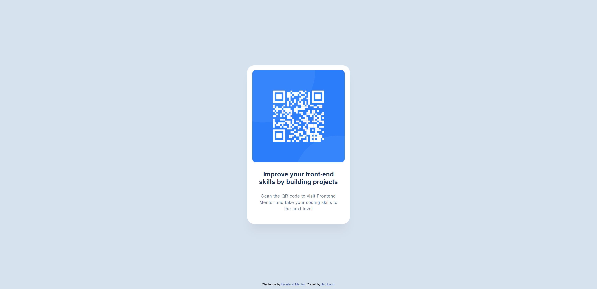

# Frontend Mentor - QR code component solution

This is a solution to the [QR code component challenge on Frontend Mentor](https://www.frontendmentor.io/challenges/qr-code-component-iux_sIO_H). Frontend Mentor challenges help you improve your coding skills by building realistic projects. 

## Table of contents

- [Overview](#overview)
  - [Screenshot](#screenshot)
- [My process](#my-process)
  - [Built with](#built-with)
  - [What I learned](#what-i-learned)
  - [Continued development](#continued-development)
- [Author](#author)

**Note: Delete this note and update the table of contents based on what sections you keep.**

## Overview

### Screenshot

## My process

### Built with

- Semantic HTML5 markup
- CSS custom properties
- Mobile-first workflow

### What I learned

The challenge was a refresher of outdated knowledge. I'm starting to find basic code tasks easier again. 

### Continued development

I would like to continue working on reproducing text pixels exactly. I would also like to deepen my knowledge of semantic HTML and Css. 

## Author

- Frontend Mentor - [@pokerlo442](https://www.frontendmentor.io/profile/yourusername)
